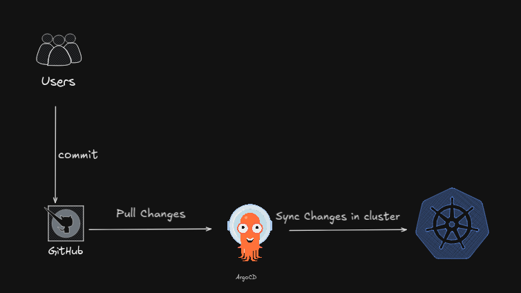

# Desafio 10 ArgoCD Helm Chart

Este respostoria tiene como finalidad el instalar y e configurar argoCD para poder sincronizar nuestros respostoria remoto (Github, gitlab) con un cluster de k8s



## Tabla de Contenidos
- [Creacion aplicacion helm](#creando-aplicacion-helm)
- [Crear Charts de Dependencia](#crear-charts-de-dependencia)
- [Configurando chart de api-nestjs y mongoDB](#configurando-chart-de-api-nestjs-y-mongodb)


## Instalar ArgoCD

Primero vamos a instlar argoCD dentro de nuetras cluster

```bash
kubectl create namespace argocd
kubectl apply -n argocd -f https://raw.githubusercontent.com/argoproj/argo-cd/stable/manifests/install.yaml

```

Primero creamos un namespace donde vamos a tener todos nuestros manifiesto de argo, y con el mando de abajo lo instalamos.
Si nos fijamos ponemos en la terminal ```kubectl get all -n argocd```` vamos a ver todo lo que argo esta ejecutando.

```bash
NAME                                                    READY   STATUS    RESTARTS        AGE
pod/argocd-application-controller-0                     1/1     Running   1               5d11h
pod/argocd-applicationset-controller-64f6bd6456-mb42d   1/1     Running   1 (5d8h ago)    5d11h
pod/argocd-dex-server-5fdcd9df8b-2w4rm                  1/1     Running   1 (5d8h ago)    5d11h
pod/argocd-notifications-controller-778495d96f-rlgzg    1/1     Running   2 (2m24s ago)   5d11h
pod/argocd-redis-69fd8bd669-sb85q                       1/1     Running   1 (5d8h ago)    5d11h
pod/argocd-repo-server-75567c944-sbl57                  1/1     Running   1 (5d8h ago)    5d11h
pod/argocd-server-5c768cdd96-px9qm                      1/1     Running   1 (5d8h ago)    5d10h

NAME                                              TYPE        CLUSTER-IP       EXTERNAL-IP   PORT(S)                      AGE
service/argocd-applicationset-controller          ClusterIP   10.102.4.151     <none>        7000/TCP,8080/TCP            5d11h
service/argocd-dex-server                         ClusterIP   10.99.243.49     <none>        5556/TCP,5557/TCP,5558/TCP   5d11h
service/argocd-metrics                            ClusterIP   10.103.80.55     <none>        8082/TCP                     5d11h
service/argocd-notifications-controller-metrics   ClusterIP   10.99.85.223     <none>        9001/TCP                     5d11h
service/argocd-redis                              ClusterIP   10.102.151.202   <none>        6379/TCP                     5d11h
service/argocd-repo-server                        ClusterIP   10.97.111.17     <none>        8081/TCP,8084/TCP            5d11h
service/argocd-server                             ClusterIP   10.107.199.174   <none>        80/TCP,443/TCP               5d11h
service/argocd-server-metrics                     ClusterIP   10.101.151.102   <none>        8083/TCP                     5d11h

NAME                                               READY   UP-TO-DATE   AVAILABLE   AGE
deployment.apps/argocd-applicationset-controller   1/1     1            1           5d11h
deployment.apps/argocd-dex-server                  1/1     1            1           5d11h
deployment.apps/argocd-notifications-controller    1/1     1            1           5d11h
deployment.apps/argocd-redis                       1/1     1            1           5d11h
deployment.apps/argocd-repo-server                 1/1     1            1           5d11h
deployment.apps/argocd-server                      1/1     1            1           5d11h

NAME                                                          DESIRED   CURRENT   READY   AGE
replicaset.apps/argocd-applicationset-controller-64f6bd6456   1         1         1       5d11h
replicaset.apps/argocd-dex-server-5fdcd9df8b                  1         1         1       5d11h
replicaset.apps/argocd-notifications-controller-778495d96f    1         1         1       5d11h
replicaset.apps/argocd-redis-69fd8bd669                       1         1         1       5d11h
replicaset.apps/argocd-repo-server-75567c944                  1         1         1       5d11h
replicaset.apps/argocd-server-5c768cdd96                      1         1         1       5d11h

NAME                                             READY   AGE
statefulset.apps/argocd-application-controller   1/1     5d11h
```
Ahora lo debemos cambiar el tipo de service que viene con argo un NodePort, para poder ingresar desde fuera del cluster

```bash
kubectl patch svc argocd-server -n argocd -p '{"spec": {"type": "NodePort"}}'

kubectl get svc argocd-server

NAME            TYPE       CLUSTER-IP       EXTERNAL-IP   PORT(S)                      AGE
argocd-server   NodePort   10.107.199.174   <none>        80:31022/TCP,443:30543/TCP   5d11h

```
Si ingresamos con la ip de nuestro cluster y el puerto que nos indica (en mi caso en el 31022) podes ver la pantalla de login de Argo.


## Ingresar a argo

El usuario predetermina de argo es "admin", pero para obtener la password debemos sacarla del su secret en kubernetes.
Para esto vamos a utilizar el siguente comando, siempre parado sobre el namesapce argocd

```bash
kubectl get secret argocd-initial-admin-secret -o jsonpath="{.data.password}" | base64 -d; echo
```

Una vez adentro, vamos a crear un nueva aplicacion. Basicamente un aplicacion en nuestro codigo que se encuentra a un respositoria al cual argo va estar esuchando cambios continuamente
Para esto voy a utilzar un repositorio abierto que contiene muchas aplcaciones de ejemplo

https://github.com/argoproj/argocd-example-apps.git

Configuramos de la siguiente manera.


Le damos crear y en la pagina principal les debe salir su aplicacion recien creada


y si vamos a nuestra terminal y buscamos en el namespace que creo argo al crear la app, vamos a ver que estan todo los recursos deplegados.

```bash
gitops-argocd/ k get all -n guesbook
NAME                                          READY   STATUS    RESTARTS   AGE
pod/guesbook-helm-guestbook-665b58dfc-brnzn   1/1     Running   0          4m48s

NAME                              TYPE        CLUSTER-IP       EXTERNAL-IP   PORT(S)   AGE
service/guesbook-helm-guestbook   ClusterIP   10.107.148.190   <none>        80/TCP    4m48s

NAME                                      READY   UP-TO-DATE   AVAILABLE   AGE
deployment.apps/guesbook-helm-guestbook   1/1     1            1           4m48s

NAME                                                DESIRED   CURRENT   READY   AGE
replicaset.apps/guesbook-helm-guestbook-665b58dfc   1         1         1       4m48s
```